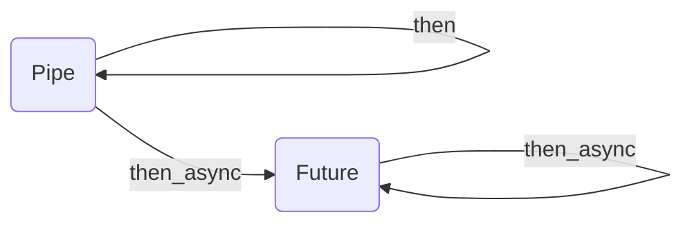

# ▶️ pymon

> Auto-generated documentation index.

`pymon` is an API for writing functional pipelines with Python3.10+.

Full Pymon project documentation can be found in [Modules](MODULES.md#pymon-modules)

- [▶️ pymon](#-pymon)
    - [Basics](#basics)
        - [`Pipe` and `Future`](#pipe-and-future)
  - [Pymon Modules](MODULES.md#pymon-modules)

## Basics

### `Pipe` and `Future`

`Pipe` and `Future` are not really monads, but some abstractions that provides
functionality for creating pipelines of sync and async functions. Inspired by
`|>` F# operator.

In F# one can write something like this to execute multiple functions
sequentially:

```fsharp
3 |> ifSome add1
  |> ifSome prod2
  |> ifNothing (fun _ -> 0)
```

Which basically means "Add 1 to value if it is some, than if result of previous
operation is some multiply it by 2, than if result of previous operation is
nothing return 0"

Python does not have such operator. In this way I've attempted to provide 2
abstraction compatible with each other - `Pipe` and `Future`.

`Pipe` is for calling synchronous functions one-by-one. Example:

```python
result = (
  Pipe(3)
  .then(lambda x: x + 1)
  .then(lambda x: x * 2)
  .finish()
)
```

> Type hints are available. VS Code for example evaluates that the result is
> `int` for this pipeline.

Also `Pipe` supports `>>` and `<<` operators for executing async and sync
functions:

```python
result = (
  Pipe(3)
  << (lambda x: x + 1)
  << (lambda x: x * 2)
).finish()
```

`finish` method is needed to return wrapped into `Pipe` container value, as on
each `then` step value returned by passed function is wrapped into `Pipe`
container for further chaining.

If your function returns `Pipe` objecct that to unpack that one can use
`@pipeline` decorator.

```python
@pipeline
def parse_http_query(query: bytes) -> dict:
  return (
    Pipe(query)
    << some_when(is_not_emtpy)
    << if_some(bytes_decode("UTF-8"))
    << if_some(str_split("&"))
    << if_some(cmap(str_split("=")))
    << if_some(dict)
    << if_none(returns({}))
  )
```

However this limits us to working with synchronous functions only. What if we
want to work with asynchronous functions (and event in synchronous context)? For
that case we have `Future` container.

`Future` is some awaitable container that wraps some awaitable value and can
evaluate next awaitable Future in synchronous context. It's easier to see once
in action than to listen twice how it works.

```python
result = await (
  Pipe(3)
  .then_async(this_async)  # returns Future
  .then(lambda x: x + 1)
  .then(lambda x: x * 2)
)
```

Like `Pipe` supports `>>` and `<<` operators for executing functions.

```python
result = await (
  Pipe(3)
  >> this_async  # returns Future
  << (lambda x: x + 1)
  << (lambda x: x * 2)
)
```

`Future` does not have `finish` method like `Pipe` as it is awaitable and in
some sense it has built-in unpacking keyword - `await`.

Basically the way this containers map to each other looks like this. While we
work with `Pipe` and sync functions we use `then` and remain in `Pipe` context.
But right at the moment we need to apply some async function `Future` comes out
and replaces `Pipe`.



#### But why only one argument functions are supported?

- Pipeline can be imagined as a tube - there is exactly **one** input and
  **one** output.
- Any function in functional programming is one-argument function. This concept
  is called curring.

Second point is actually the one that makes most problems. I see 3 significantly
different ways of doing curring in Python:

- Python `partial` from `functools` standart package.
- Decorator like `@curry` from `toolz` package.
- Writing Highter-Order Functions by yourself.

There are drawbacks of each of the method:

| Method | 👍 | 👎 |
| --- | --- | --- |
| `partial` | no additional dependencies; | type hints are lost; bad-looking syntax; |
| `@curry` | easy syntax for any fucntion; | type hints are lost; |
| HOFs | type hints remain; | might seem verbouse; |

I consider it is a matter of personal preference which way to stick to, but I
prefer the last option. In many cases it is not that difficult and hard to write
a few more lines of code somewhere outside.

Also as some incomplete curring shortcut several decorators provided - `hof1`,
`hof2` and `hof3`. This decorators separate first X (1, 2 or 3 correspondingly)
arguments of function with other.

```python
@hof1
def split(separator: str, data: str) -> list[str]:
  return data.split(separator)

@hof1
def encode(encoding: str, data: str) -> bytes:
  return data.encode(encoding)

result = (
  Pipe("Hello, world!")
  << split(" ")
  << cmap(encode("UTF-8"))
  << list
).finish()

# same as
result = list(map(lambda s: s.encode("UTF-8"), "Hello, World!".split(" ")))
```

In this way actually any function with multiple arguments can become
singleargument function without lossing type hints.

#### Why 3 is max number of arguments for function to put in HOF?

I consider that if you have more than 3 arguments for your function than this
function is bad and data structures you use are bad. They are complex and make
it hard to write truly declarative code.

#### Why not to use `tuple` as single argument?

Valid suggestion, however this makes args projections between chained functions
much more complex and you can'y easily convert function to HOF.

#### Some common HOFs

There are multiple common HOF composable functions:

- `creducel` - curried reduce left
- `creducer` - curried reduce right
- `cmap` - curried map
- `cfilter` - curried filter

#### Some common point-free utilities

Point-free means that function is not used with "dot notation" (like method).

- for `str`
  - `str_center` - point-free `str.center`
  - `str_count` - point-free `str.count`
  - `str_encode` - point-free `str.encode`
  - `str_endswith` - point-free `str.endswith`
  - `str_find` - point-free `str.find`
  - `str_index` - point-free `str.index`
  - `str_removeprefix` - point-free `str.removeprefix`
  - `str_removesuffix` - point-free `str.removesuffix`
  - `str_replace` - point-free `str.replace`
  - `str_split` - point-free `str.split`
  - `str_startswith` - point-free `str.startswith`
  - `str_strip` - point-free `str.strip`
- for `bytes`
  - `bytes_center` - point-free `bytes.center`
  - `bytes_count` - point-free `bytes.count`
  - `bytes_decode` - point-free `bytes.decode`
  - `bytes_endswith` - point-free `bytes.endswith`
  - `bytes_find` - point-free `bytes.find`
  - `bytes_index` - point-free `bytes.index`
  - `bytes_removeprefix` - point-free `bytes.removeprefix`
  - `bytes_removesuffix` - point-free `bytes.removesuffix`
  - `bytes_replace` - point-free `bytes.replace`
  - `bytes_split` - point-free `bytes.split`
  - `bytes_startswith` - point-free `bytes.startswith`
  - `bytes_strip` - point-free `bytes.strip`
- for `dict`
  - `dict_maybe_get` - point-free `dict.get(key, None)`
  - `dict_try_get` - point-free `dict[key]`
