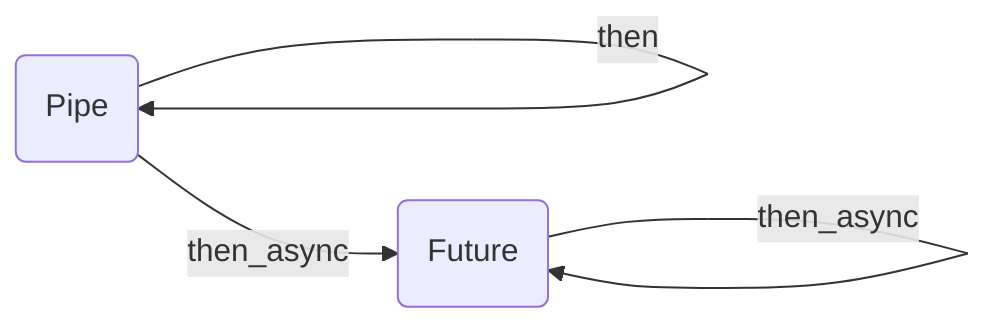
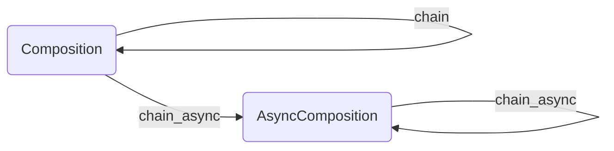

# Pymon Index

> Auto-generated documentation index.

<h1 align="center">🔃pymon</h2>

Full Pymon project documentation can be found in [Modules](MODULES.md#pymon-modules)

- [Pymon Index](#pymon-index)
    - [Monads API](#monads-api)
        - [`Pipe` and `Future`](#pipe-and-future)
        - [`Composition` and `AsyncComposition`](#composition-and-asynccomposition)
  - [Pymon Modules](MODULES.md#pymon-modules)

`pymon` is a set of simple common monads for writing safe, maintainable and
pipeline-based code in Python3.10+.

## Monads API

### `Pipe` and `Future`

`Pipe` and `Future` are not really monads, but some abstractions that provides
functionality for creating pipelines of sync and async functions. Inspired by
`|>` F# operator.

In F# one can write something like this to execute multiple functions
sequentially:

```fsharp
3 |> ifSome add1
  |> ifSome prod2
  |> ifNothing (fun _ -> 0)
```

Which basically means "Add 1 to value if it is some, than if result of previous
operation is some multiply it by 2, than if result of previous operation is
nothing return 0"

Python does not have such operator. In this way I've attempted to provide 2
abstraction compatible with each other - `Pipe` and `Future`.

`Pipe` is for calling synchronous functions one-by-one. Example:

```python
result = (
  Pipe(3)
  .then(lambda x: x + 1)
  .then(lambda x: x * 2)
  .finish()
)
```

`finish` method is needed to return wrapped into `Pipe` container value, as on
each `then` step value returned by passed function is wrapped into `Pipe`
container for further chaining.

> Type hints are available. VS Code for example evaluates that the result is
> `int` for this pipeline.

However this limits us to working with synchronous functions only. What if we
want to work with asynchronous functions (and event in synchronous context)? For
that case we have `Future` container.

`Future` is some awaitable container that wraps some awaitable value and can
evaluate next awaitable Future in synchronous context. It's easier to see once
in action than to listen twice how it works.

```python
result = await (
  Pipe(3)
  .then_async(this_async)  # returns Future
  .then(lambda x: x + 1)
  .then(lambda x: x * 2)
  .finish()  # completely optional as Future is awaitable by itself
)
```

Basically the way this containers map to each other looks like this. While we
work with `Pipe` and sync functions we use `then` and remain in `Pipe` context.
But right at the moment we need to apply some async function `Future` comes out
and replaces `Pipe`.



These are 2 containers that provide this text-like pipelines to Python world.
They might seem a bit verbous and as a concept I studied if some operators could
be overloaded to achieve prettier result, however it might make code less
understandable to other developers as behavior of `>>` or `<<` might be
completely non-obvious.

#### But why only one argument functions are supported?

- Pipeline can be imagined as a tube - there is exactly **one** input and
  **one** output.
- Any function in functional programming is one-argument function. This concept
  is called curring.

Second point is actually the one that makes most problems. I see 3 significantly
different ways of doing curring in Python:

- Python `partial` from `functools` standart package.
- Decorator like `@curry` from `toolz` package.
- Writing Highter-Order Functions by yourself.

There are drawbacks of each of the method:

| Method | 👍 | 👎 |
| --- | --- | --- |
| `partial` | no additional dependencies; | type hints are lost; bad-looking syntax; |
| `@curry` | easy syntax for any fucntion; | type hints are lost; |
| HOFs | type hints remain; | might seem verbouse; |

I consider it is a matter of personal preference which way to stick to, but I
prefer the last option. In many cases it is not that difficult and hard to write
a few more lines of code somewhere outside.

Also as some incomplete curring shortcut several decorators provided - `hof_2`,
`hof_3`, `hof_4` and `hof_5`. This decorators convert function with X arguments
into Highter-Order Function with X-1 arguments and returns `Pipe`-ready
function.

```python
@hof_2
def split(separator: str, data: str) -> list[str]:
  return data.split(separator)

@hof_2
def encode(encoding: str, data: str) -> bytes:
  return data.encode(encoding)

result = (
  Pipe("Hello, world!")
  .then(split(" "))
  .then(cmap(encode("UTF-8")))
  .then(list)
  .finish()
)
# same as
result = list(map(lambda s: s.encode("UTF-8"), "Hello, World!".split(" ")))
```

In this way actually any function with multiple arguments can become
singleargument function without lossing type hints.

#### Why 5 is max number of arguments for function?

I consider that if you have more than 3 arguments for your function than this
function is bad and data structures you use are bad. They are complex and make
it hard to write truly declarative code.

#### Why not to use `tuple` as single argument?

Valid suggestion, however this makes args projections between chained functions
much more complex and you can'y easily convert function to HOF.

### `Composition` and `AsyncComposition`

Function Composition is also one important tool in Functional Programming. To
provide nice, clean and type-safe way to do that `Composition` and
`AsyncComposition` abstractions are provided. These classes abstract sync and
async functions and extend them with additional `chain` and `chain_async`
functions for composing both sync and async functions. They relate to each other
pretty much like `Pipe` and `Future`:



For easier syntx there are also decorators for functions:

- `composable`
- `async_composable`
- `composable_hof_2`
- `composable_hof_3`
- `composable_hof_4`
- `composable_hof_5`
- `async_composable_hof_2`
- `async_composable_hof_3`
- `async_composable_hof_4`
- `async_composable_hof_5`

Decorators that combine `composable` and `hof` do not make HOF composable, but
make the returned by `hof` function composable.

```python
query = b"name=John&age=32"

parse_query = (
    composable(lambda b: b.decode("UTF-8"))
    .chain(lambda s: s.split("&"))
    .chain(cmap(lambda s: s.split("=")))
    .chain(dict)
)

print(parse_query(query))  # {'name': 'John', 'age': '32'}
```

#### Some common HOFs

There are multiple common HOF composable functions:

- `creducel` - curried reduce left
- `creducer` - curried reduce right
- `cmap` - curried map
- `cfilter` - curried filter
